# lab02
## Домашнее задание

**Студента группы ИУ8-21**
**Барш Иван**

<details>
<summary>Part I</summary>

1. Создайте пустой репозиторий на сервисе github.com (или gitlab.com, или bitbucket.com).  
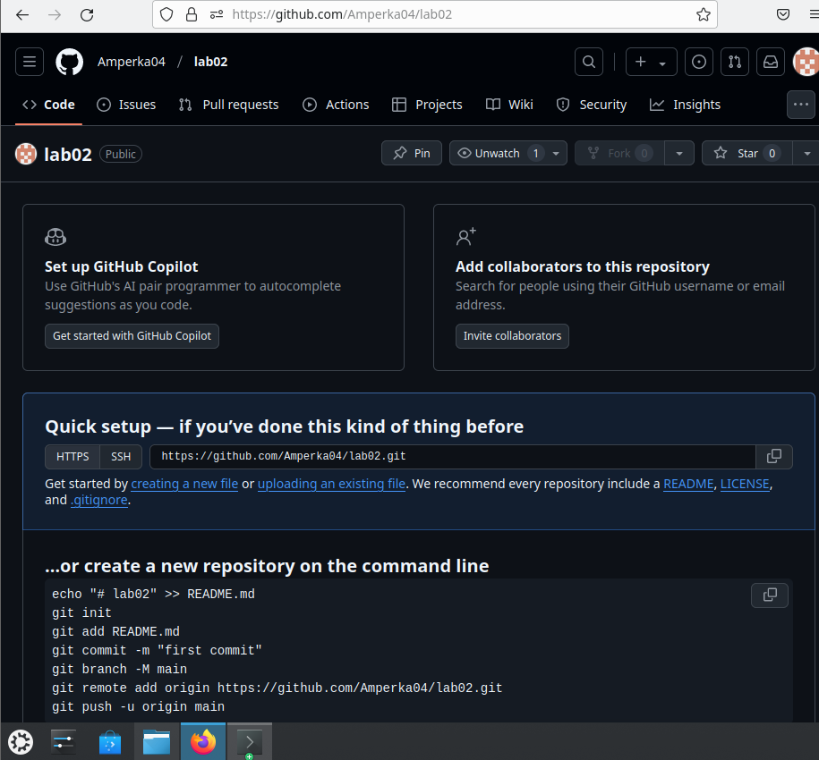

2. Выполните инструкцию по созданию первого коммита на странице репозитория, созданного на предыдещем шаге.
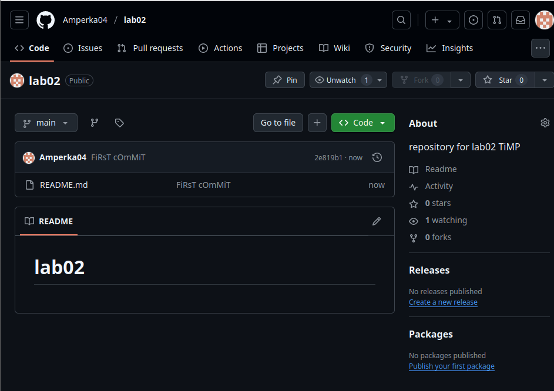

3. Создайте файл ```hello_world.cpp```
в локальной копии репозитория (который должен был появиться на шаге 2). Реализуйте программу **Hello world** на языке C++ используя плохой стиль кода. Например, после заголовочных файлов вставьте строку ```using namespace std;```.
```sh
nano hello_world.cpp
```
Открылся редактор файлов, в котором была написана нужная программа.

4. Добавьте этот файл в локальную копию репозитория.
```git add .```

5. Закоммитьте изменения с осмысленным сообщением.\
```git commit -m "added 1st programm(hello_world.cpp)"```
```sh
[main 2e6d71d] added 1st programm(hello_world.cpp)
 1 file changed, 5 insertions(+)
 create mode 100644 hello_world.cpp
```

6. Изменитьте исходный код так, чтобы программа через стандартный поток ввода запрашивалось имя пользователя. А в стандартный поток вывода печаталось сообщение ```Hello world from @name```
, где ```@name```
имя пользователя. 

Добавили строки
```sh include <string> string name; cin >> name;```

7. Закоммитьте новую версию программы. Почему не надо добавлять файл повторно git add?

```git commit -m "modified hello_world.cpp"```

```sh
Текущая ветка: main
Ваша ветка опережает «origin/main» на 1 коммит.
  (используйте «git push», чтобы опубликовать ваши локальные коммиты)

Изменения, которые не в индексе для коммита:
  (используйте «git add <файл>...», чтобы добавить файл в индекс)
  (используйте «git restore <файл>...», чтобы отменить изменения в рабочем каталоге)
        изменено:      hello_world.cpp
```

8. Запуште изменения в удалёный репозиторий.\
```git push```

9. Проверьте, что история коммитов доступна в удалёный репозитории.\
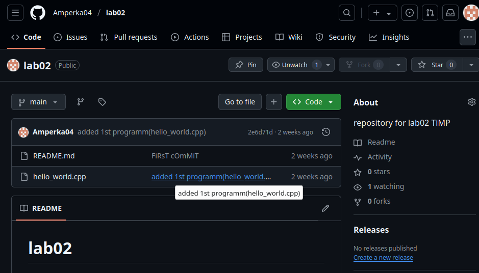
</details>

<details>
<summary>Part II</summary>

1. В локальной копии репозитория создайте локальную ветку ```patch1```.\
```git branch patch1
git push origin patch1
```

2. Внесите изменения в ветке ```patch1```
по исправлению кода и избавления от ```using namespace std;```

Перешли в ветку ```patch1```: ```git checkout patch1```
Изменили файл также через nano.

3. **commit, push** локальную ветку в удалённый репозиторий.
```sh
git commit -am "vers. without 'using namespace std;'"
git push --set-upstream lab2 patch1
```

4. Проверьте, что ветка ```patch1```
доступна в удалёный репозитории.
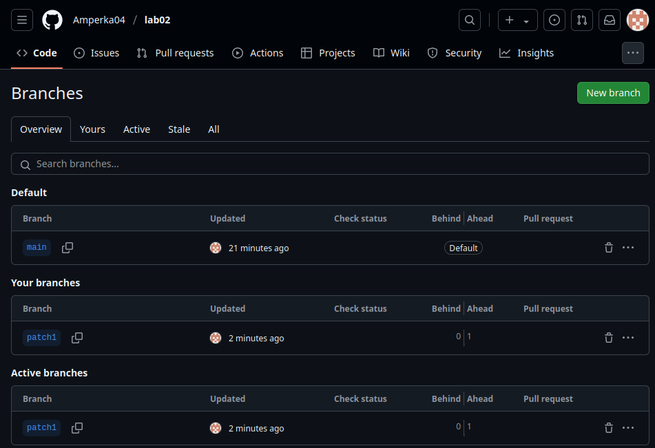

5. Создайте pull-request ```patch1 -> master```
Для этого на самой странице репозитория надо нажать кнопку ```Compare && pull request```
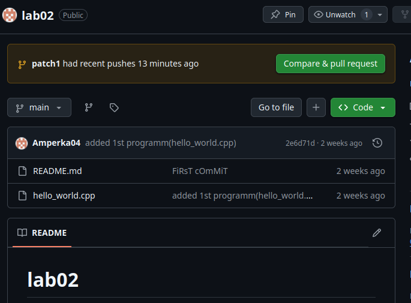

6. В локальной копии в ветке ```patch1```
добавьте в исходный код комментарии. 
Всё также через nano добавили комментарии.

7. **commit, push** сделали аналогично предыдущему подобному шагу.
```sh
git commit -am "vers. without 'using namespace std;' 2"
git push --set-upstream lab02 patch1
```

8. Проверьте, что новые изменения есть в созданном на **шаге 5** pull-request.\


9. В удалённый репозитории выполните слияние PR ```patch1 -> master```
и удалите ветку ```patch1```
в удаленном репозитории.
Это всё делается в интерфейсе GitHub, по приведенной ниже инструкции на фотографиях.
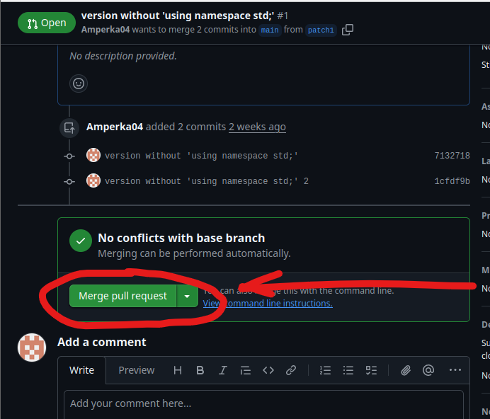
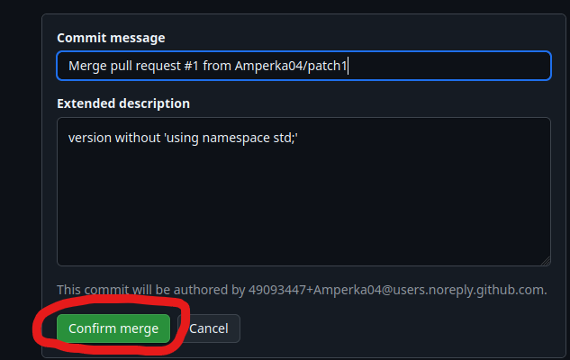
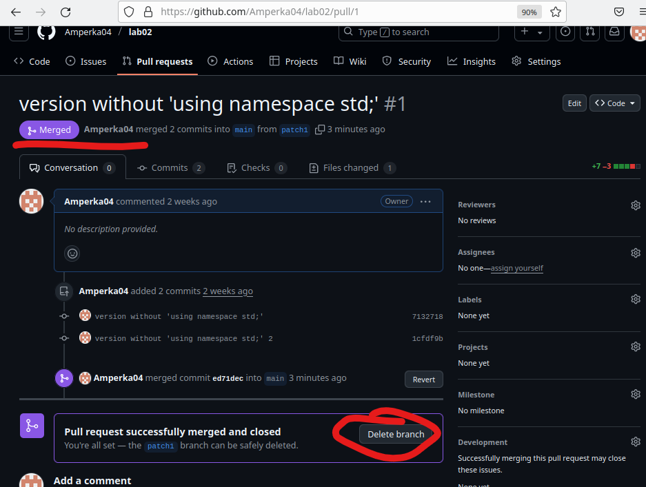
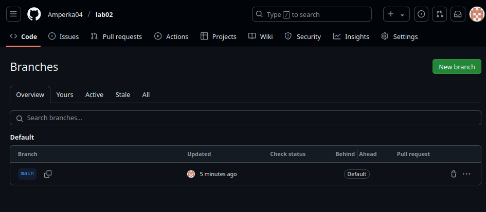

10. Локально выполните **pull** 

```git checkout main```
- перейти в основную ветку 

```git pull```
- получить все изменения 

11. С помощью команды **git log** просмотрите историю в локальной версии ветки ```master```
<details>
<summary>Вывод команды:</summary>

```sh
Merge: 2e6d71d 1cfdf9b
Author: Amperka04 <49093447+Amperka04@users.noreply.github.com>
Date:   Fri Apr 11 01:13:22 2025 +0300

    Merge pull request #1 from Amperka04/patch1
    
    version without 'using namespace std;'

commit 1cfdf9bc5a0b5e3ace3b696334677bc32f6b7f7f (origin/patch1, patch1)
Author: Amperka04 <barshivan@gmail.com>
Date:   Fri Apr 11 00:44:04 2025 +0300

    version without 'using namespace std;' 2

commit 7132718ed38bf909b57e4a2b174951342f686ea8
Author: Amperka04 <barshivan@gmail.com>
Date:   Fri Mar 28 16:41:26 2025 +0300

    version without 'using namespace std;'

commit 2e6d71df4fccd322e97a4315f7f94d4c53e356dc
Author: Amperka04 <barshivan@gmail.com>
Date:   Fri Mar 14 17:21:24 2025 +0300

    added 1st programm(hello_world.cpp)

commit 2e819b1e463fe36c4d8b855d305e6802d00ac3e6
Author: Amperka04 <barshivan@gmail.com>
Date:   Fri Mar 14 17:06:24 2025 +0300

    FiRsT cOmMiT
```
</details>

12. Удалите локальную ветку ```patch1```

```git branch -d patch1```
- удаляем локально ветку ```patch1```

```git fetch --prune```
- удаляем информацию об удалённой ветке

</details>

<details>
<summary>Part III</summary>

1. Создайте новую локальную ветку ```patch2```.

```sh
git branch patch2 // Содание новой ветки
git checkout patch2 // Переход в новую ветку
```

2. Измените code style с помощью утилиты clang-format. Например, используя опцию ```-style=Mozilla```
```clang-format -style=Mozilla -i hello_world.cpp```
изменили формат

3. **commit, push**, создайте pull-request ```patch2 -> master```.
```sh
git commit -am "changed style 'hello_world.cpp' to Mozila"
git push --set-upstream lab02 patch2
```
pull-request содаётся через сайт Git-Hub при помощи зеленой кнопки "Compare & pull request"

4. В ветке master в удаленном репозитории измените комментарии, например, расставьте знаки препинания, переведите комментарии на другой язык.\
Выполняется через сайт. Полное выполнение данного пункта можно увидеть в истории commit'ов репозитория
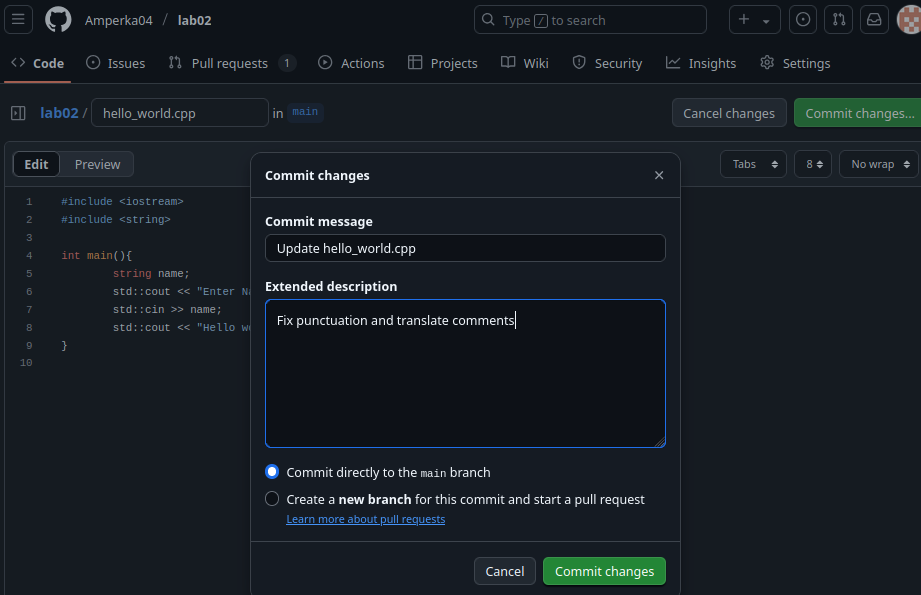

5. Убедитесь, что в pull-request появились конфликтны.
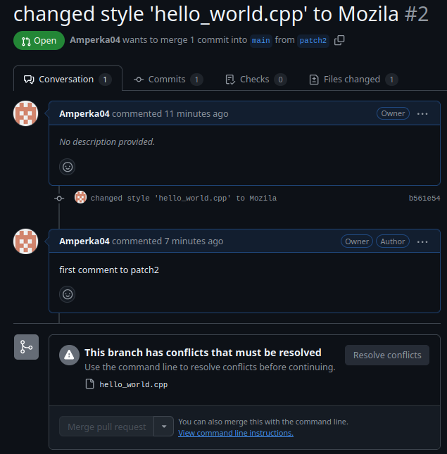

6. Для этого локально выполните **pull + rebase** (точную последовательность команд, следует узнать самостоятельно). **Исправьте конфликты.**
```sh
git pul --rebase lab2 main
nano hello_world.cpp // Исправляем конфликт в файле (удаляем маркеры <<, ==, >>)
git add hello_world.cpp // Фиксируем изменения 
git rebase --continue // Продолжаем исправление конфликтов
```

7. Сделайте force push в ветку ```patch2```
```sh
git push lab02 patch2 --force-with-lease
```
//--force-with-lease для безопасного форсированного пуша


8. Убедитеcь, что в pull-request пропали конфликтны.
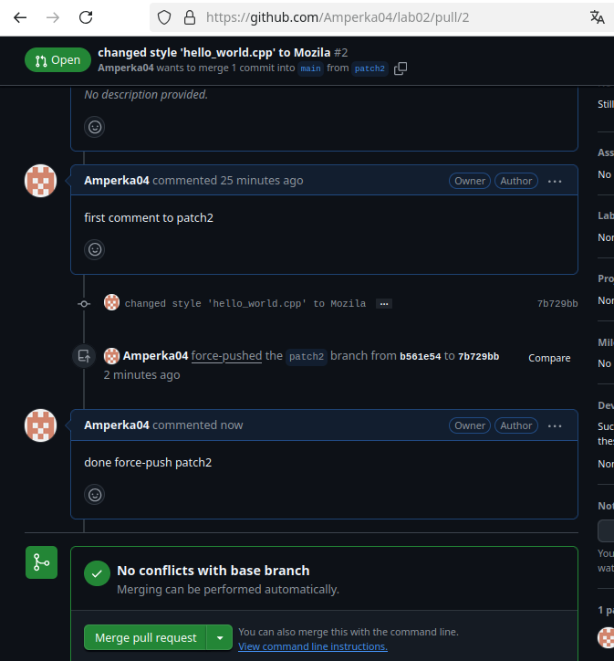


9. Вмержите pull-request ```patch2 -> master```
Последовательность действий аналогична шагам в **пункте 8 в Part II**.
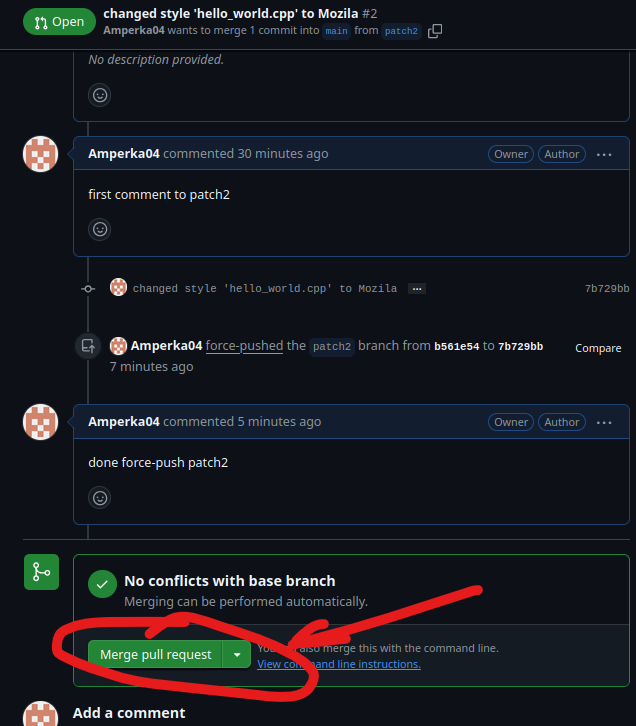
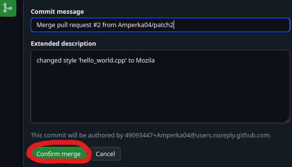
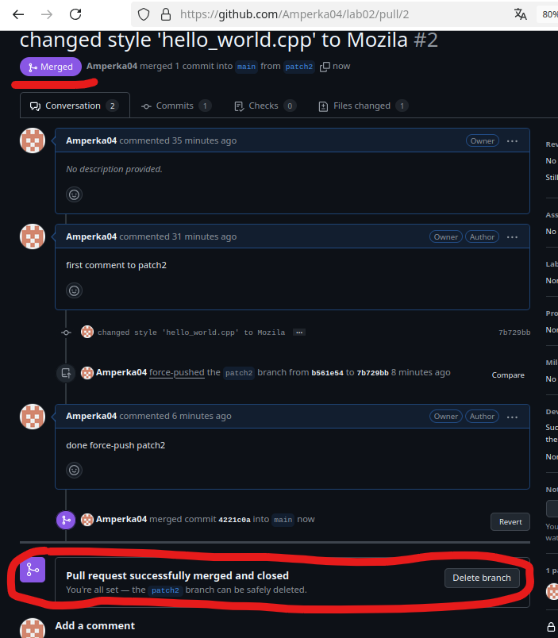
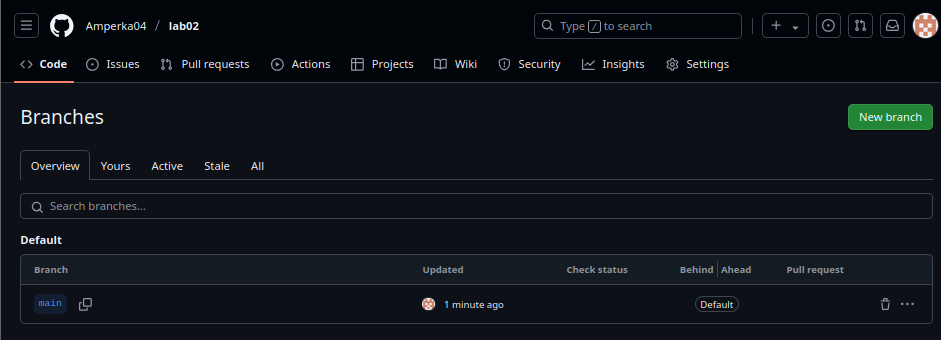
</details>


##Конец!
